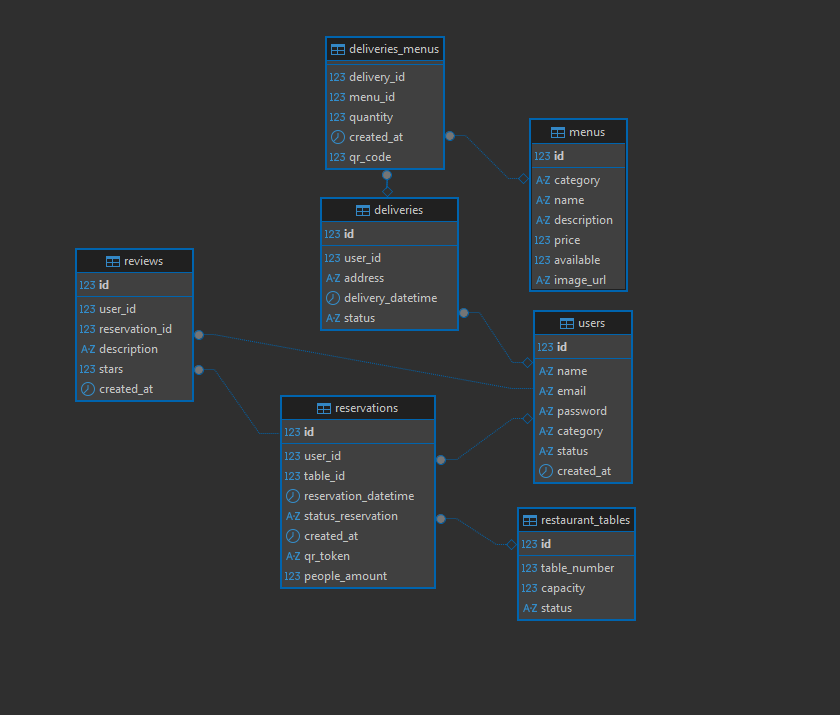

# Proyecto Final Integrador - FIUBA IDS Lanzillota 

---

## 1. Carátula

- **Tema elegido:** Sitio gastronómico
- **Tutor asignado:** Martín
- **Repositorio Backend:** https://github.com/elimenit/tp3_ids_backend
- **Repositorio Frontend:** https://github.com/elimenit/tp3_ids_frontend

---

## 2. Integrantes

| Nombre | Padrón |
|---|---|
| Tiziano Longo | 115410 |
| Pedro Santiago Osorio | 115526 |
| Nicolás Adrián Vera | 112300 |
| Lucas Nahuel Fontana Gomes | 115836 |
| Rodrigo Cuellar | 114513 |
| Facundo Nunes | 108008 |
| Yachak Vilcapuma | 113834 |
| Agustin Tarcaya | 114430 |
| Hernan Condori | 114350 |

---

## 3. Resumen

Se desarrolló un sistema de gestión y venta orientado a la gastronomía para gestionar productos y reservas, que a su vez permite atraer a nuevos clientes a través de un sistema ágil de reservaciones, delivery de productos y reseñas que dan transparencia al servicio del restaurante. 

El sistema fue implementado siguiendo una arquitectura de tres capas (frontend, backend, base de datos) con separación clara entre módulos administrativos y públicos, permitiendo que el local gestione de forma integral sus operaciones desde un panel de control intuitivo.

---

## 4. Introducción

### 4.1 Contexto y motivación

En el mundo gastronómico, la digitalización es cada vez más importante para mejorar la experiencia del cliente y optimizar la gestión operativa. Los restaurantes necesitan herramientas que les permitan no solo atender clientes presenciales, sino también ofrecer servicios online como reservas, delivery y feedback de clientes. Este proyecto surge como respuesta a esa necesidad: crear una plataforma integral que centralice la administración de un restaurante, desde la gestión del menú hasta el análisis de datos de desempeño.

El equipo eligió este tema porque combina aspectos técnicos complejos (integración de múltiples servicios, autenticación de usuarios, reportes en tiempo real) con un caso de uso real que es fácil de entender y validar. Además, permite aplicar todos los conceptos aprendidos en la materia: Backend REST, Frontend dinámico, Base de datos relacional, control de versiones, metodologías ágiles y buenas prácticas de desarrollo.

### 4.2 Objetivos del proyecto

**Objetivo general:**  
Desarrollar una plataforma web integral para la gestión y venta en un restaurante, que facilite tanto la experiencia del cliente como la administración del local.

**Objetivos específicos:**
- Implementar un sistema de autenticación con roles diferenciados (cliente, administrador) que permita acceso seguro a funcionalidades específicas.
- Crear un catálogo dinámico de menú con información de productos, precios y restricciones alimenticias.
- Desarrollar un sistema de reservas online que incluya confirmación por mail y QR de verificación.
- Implementar un servicio de delivery con carrito de compra y seguimiento de pedidos.
- Permitir que clientes dejen reseñas y calificaciones del servicio.
- Construir dashboards administrativos que muestren estadísticas y análisis de reservas, delivery y reseñas en diferentes períodos.
- Aplicar buenas prácticas de programación, versionado en GitHub y metodologías ágiles (Kanban) en el trabajo en equipo.
- Dockerizar la aplicación para facilitar su deploy y escalabilidad.

### 4.3 Alcance

**Incluye:**

- **Frontend público:** información del local, fotos, menú con precios, reseñas de comensales, selección de productos para delivery, flujo de compra y reserva.
- **Reservas:** flujo ágil (día → horario → cantidad de personas → confirmación por mail), generación de QR asociado a la reserva, cancelación desde el mail.
- **Delivery:** selección de productos, carrito de compra, checkout, confirmación del pedido y seguimiento del estado.
- **Usuarios y roles:** registro/login con distintos roles (cliente regular, administrador).
- **Panel administrativo:** ABM de menú (con imágenes y restricciones alimenticias), ABM de reseñas, ABM de servicios extra, gestión de reservas y de delivery, visualización de estadísticas.
- **Dashboards informativos:** gráficos en tiempo real de reservas, delivery, reseñas y otros indicadores del local, con filtros por rango temporal.
- **Integración con servicios externos:** envío de mails de confirmación, generación dinámica de QR.
- **Dockerización:** proyecto containerizado para fácil despliegue.

---

## 5. Solución propuesta

### 5.1 Descripción general

Para un mayor orden e independencia de funcionamiento, se decidió dividir el proyecto en dos repositorios: uno para el backend, donde consta de la API que maneja la base de datos y los procesos; y otro para el frontend, donde se trata de otra API implementada con Flask, que no únicamente se encarga de renderizar el HTML con Jinja2, sino también comunicarse con el Backend a través de las diversas interacciones del usuario.

A su vez, se optó por dividir firmemente la lógica administrativa contra la pública, tanto de manera organizativa como técnica. Esto se cubre en mayor profundidad en los puntos **5.2** y **6.6** respectivamente.

La comunicación entre frontend y backend se realiza mediante solicitudes REST en formato JSON, permitiendo una separación clara de responsabilidades: el frontend maneja la presentación y la lógica de interacción del usuario, mientras que el backend centraliza toda la lógica de negocio, validaciones y acceso a datos.

### 5.2 Organización del sistema

El sistema se organizó en cuatro directorios principales, los cuales todos (a excepción de helpers) tienen sus sub-divisiones para los archivos administrativos y públicos. En cada directorio podremos encontrar un módulo para cada sección.

Ejemplo: `database/admin/users.py`

Un módulo por implementación que permite dividir los procesos de una manera más eficiente, ordenada y escalable. Este enfoque (con ayuda de los `Blueprints`) es el mismo que utilizamos a la hora de asignar las rutas para cada uno de los endpoints.

#### 5.2.1 database
Se encarga de las consultas a la base de datos, esto incluye validaciones básicas, extracción, actualización, creación y eliminación. Cada módulo en este directorio corresponde a una entidad (usuarios, reservas, productos, etc.).

#### 5.2.2 services
Lógica de negocio y validaciones. Son las funciones que son utilizadas en los endpoints. Aquí se implementan reglas de negocio complejas como la validación de disponibilidad de mesas, cálculo de montos de pedidos, generación de tokens, etc.

#### 5.2.3 routers
Endpoints que respetan RESTful. Se implementan siguiendo las convenciones HTTP (GET, POST, PUT, DELETE) y están organizados por recurso (productos, reservas, usuarios, etc.).

#### 5.2.4 helpers
Variedad de funciones auxiliares. Incluye utilidades para generación de QR, envío de mails, validación de tokens, manejo de fechas, etc.

### 5.3 Modelo de datos

La base de datos del sistema (`restaurant`) está estructurada bajo el modelo relacional en MySQL. Está compuesta por las siguientes tablas interconectadas que gestionan el flujo operativo del establecimiento:

* **users:** Almacena las cuentas de usuarios, permitiendo segmentar accesos y permisos mediante roles del sistema (`category`) y controlar su disponibilidad (`status`).
* **menus:** Centraliza la oferta gastronómica del restaurante, registrando detalles del plato, precio, disponibilidad comercial y su imagen.
* **restaurant_tables:** Define la infraestructura física del salón, controlando el número de mesa, su capacidad de comensales y su estado de ocupación actual.
* **reservations:** Gestiona las reservas de mesas vinculando clientes con mesas específicas, incluyendo el control de asistencia y un token único para validación por QR.
* **reviews:** Permite a los usuarios calificar y dejar comentarios sobre sus reservaciones, con una restricción que limita la puntuación de 1 a 5 estrellas.
* **deliveries:** Registra las órdenes de pedido a domicilio asignadas a un usuario, haciendo el seguimiento del estado del envío y la dirección de entrega.
* **deliveries_menus:** Tabla intermedia que detalla los platos y cantidades incluidos en cada pedido de delivery, incorporando un código de control.

#### 5.3.1 Consideraciones de Integridad y Auditoría

1. **Auditoría Temporal:** Las entidades operativas clave (`users`, `reservations`, `reviews`, `deliveries`, `deliveries_menus`) incluyen de forma nativa el campo `created_at` con marcas de tiempo automatizadas para mantener la trazabilidad histórica.
2. **Ciclo de Vida por Estados:** El modelo aprovecha tipos de datos enumerados (`ENUM`) específicos para reflejar con precisión el estado real del negocio en usuarios, mesas, reservas y envíos.

#### 5.3.2 Diagrama Entidad-Relación


### 5.4 Arquitectura del sistema

```
Cliente (navegador)
    \\ HTTP/HTML
    Frontend (Flask)
    \\ REST/JSON
    Backend (Flask API)
    \\ SQL
    Base de datos MySQL
        
    + Servicios externos (Mail, QR)
```

El frontend expone rutas HTML tradicionales para renderizar las páginas; el backend expone endpoints REST que el frontend consume desde Python. Esta separación permite que el backend sea reutilizable que el frontend sea independiente de cambios en la lógica de negocio.

### 5.5 Funcionalidades principales implementadas

- **Menú dinámico:** catálogo de productos con filtros por categoría y restricciones alimenticias.
- **Reservas online:** selección de fecha, horario, mesa y cantidad de comensales; confirmación por email con QR.
- **Delivery:** carrito de compra, checkout, confirmación de pedido.
- **Reseñas y calificaciones:** usuarios pueden dejar feedback post-visita.
- **Dashboards administrativos:** gráficos e indicadores por período (diario, mensual, anual).
- **ABM de entidades:** paneles para gestionar productos, usuarios, reservas, reseñas.
- **Autenticación y autorización:** login/registro con tokens JWT, roles diferenciados.
- **Eliminación lógica:** registros marcados como eliminados pero preservados en la base de datos.
- **Integración con servicios externos:** envío de mails via SMTP, generación de QR dinámicos.

### 5.6 Decisiones de diseño

**Separación de repositorios (Frontend y Backend):**  
Se optó por mantener el frontend y backend en repositorios separados para permitir independencia en el deploy, versionado y evolución futura. Esto también facilita que equipos diferentes trabajen en paralelo sin conflictos de merge.

**Arquitectura de tres capas (Frontend, Backend, BD):**  
Esta separación permite que cada capa tenga responsabilidades claras: el frontend maneja UX, el backend maneja lógica de negocio y acceso a datos, la BD almacena estado. Facilita testing, mantenimiento y escalabilidad.

**Blueprints en Flask para modularidad:**  
En lugar de un único archivo de rutas, se organizaron los endpoints en blueprints por recurso (usuarios, reservas, productos, etc.), permitiendo código más limpio y escalable.

**Eliminación lógica en lugar de física:**  
Se decidió marcar registros como eliminados en lugar de borrarlos, preservando el historial para análisis y evitando problemas de integridad referencial.

**Tokens en cookies para autenticación:**  
Se eligió guardar los tokens de sesión en cookies HTTP-only por seguridad, evitando vulnerabilidades de XSS que surgen de guardarlos en localStorage.

**Templates Jinja2 con renderizado inicial y JavaScript dinámico:**  
El frontend renderiza templates iniciales en el servidor y usa JavaScript vanilla para actualizar dinámicamente dashboards y demás estados.

## 6. Funcionalidades

### 6.1 Menú

El menú es el corazón del sistema. Los clientes pueden visualizar todos los productos disponibles en la plataforma con información detallada: nombre, descripción, precio, foto. El menú puede ser filtrado por categoría (entrada, plato principal, bebida, etc.) para facilitar la navegación.

**Desde el panel administrativo:**
- Crear nuevos productos.
- Editar productos existentes (precio, descripción, disponibilidad).
- Eliminar productos (eliminación lógica; no se borran pero se ocultan).
- Visualizar lista completa de productos.

### 6.2 Reservas

El proceso de reserva es ágil y orientado a la experiencia del usuario. Un cliente interesado en reservar sigue estos pasos:

1. Ingresa la **fecha** deseada.
2. Selecciona el **horario** disponible (el sistema consulta qué horas están libres según las mesas disponibles).
3. Elige la **cantidad de personas** (el sistema filtra mesas con capacidad suficiente).
4. Confirma la reserva.
5. Recibe un **email de confirmación** con un **código QR único** que codifica los datos de la reserva.
6. Cuando llega al local, **escanea el QR en la puerta** para confirmar su asistencia (o el personal lo hace).

**Desde el panel administrativo:**
- Visualizar todas las reservas con estado (pendiente, confirmada, completada, cancelada).
- Consultar disponibilidad de mesas por fecha y horario.
- Marcar reservas como completadas manualmente.
- No se pueden modificar reservas pasadas (no tiene sentido hacerlo, se pierde información)

### 6.3 Delivery

El sistema de delivery permite que clientes pidan productos para llevar o entregar en su domicilio. El flujo es similar al de un e-commerce tradicional:

1. El cliente selecciona **productos del menú** y los agrega al **carrito**.
2. Especifica si es **retiro en el local** o **entrega a domicilio** (con dirección).
3. Realiza el **checkout** (en versión básica sin pasarela de pago).
4. Recibe una **confirmación por email** con el número de pedido.
5. Puede **ver el estado del pedido** en tiempo real (preparando, listo, en camino, entregado).

### 6.4 Reseñas

Las reseñas son testimonios que dejan los clientes después de comer en el restaurante. Funcionan como un sistema de feedback y transparencia:

1. Un cliente que ya visitó el local (después de una reserva confirmada) puede **dejar una reseña**.
2. Proporciona una **calificación en estrellas** (1 a 5) y un **comentario textual**.
3. La reseña aparece inmediatamente en la sección **"Reseñas"** del sitio público (con posible moderación del administrador).

**Desde el panel administrativo:**
- Visualizar todas las reseñas recibidas (filtradas por fecha, puntuación, cliente).
- **Aprobar o rechazar reseñas** antes de que aparezcan en el sitio público (moderación).
- **Responder a reseñas** con comentarios del restaurante.
- Visualizar estadísticas: puntuación promedio, cantidad de reseñas por período, distribución por estrellas.

**Características técnicas:**
- Solo usuarios autenticados que hayan tenido una reserva o compra confirmada pueden reseñar.
- Cada usuario puede dejar una sola reseña por experiencia (evitar spam).
- Las reseñas se almacenan con timestamp para análisis temporal.

---

## 6.5 Dashboards administrativos

El apartado de dashboards está presente únicamente para los usuarios administradores, y cuenta con un panel en el cual pueden visualizar las estadísticas de cada uno de los servicios brindados por la página web.

La idea es que cada vez que el administrador seleccione una opción (delivery, reseñas o reservas) y un rango temporal, se carguen los datos de manera inicial utilizando Jinja, y luego se modifiquen los gráficos de manera dinámica en base a las agrupaciones temporales seleccionados por el usuario (si aplica para el gráfico, por ejemplo en líneas).

#### 6.5.1 Agrupaciones temporales
- Diario
- Mensual 
- Anual

#### 6.5.2 Opciones Disponibles

**Reservas**
1. **Evolución de reservas:** gráfico de líneas mostrando cantidad de reservas por agrupación temporal.
2. **Estado de reservas:** gráfico de torta mostrando distribución entre pendientes, confirmadas y completadas.
3. **Ocupación por franja horaria:** heatmap mostrando qué horarios tienen más demanda.
4. **Reservas por capacidad de mesa:** gráfico de barras mostrando cuántas reservas usa cada tamaño de mesa.

**Delivery**
1. **Ingresos por período:** gráfico de líneas mostrando ingresos acumulados en el tiempo.
2. **Productos más vendidos:** gráfico de barras horizontales con los top 10 productos.
3. **Pedidos por franja horaria:** heatmap similar al de reservas, mostrando patrones de compra.
4. **Pedidos por estado:** gráfico de torta mostrando cuántos pedidos están en cada estado.

**Reseñas**
1. **Distribución de estrellas:** gráfico de barras mostrando cuántas reseñas de 1, 2, 3, 4 y 5 estrellas hay.
2. **Evolución del promedio:** gráfico de líneas mostrando cómo varía la calificación promedio en el tiempo.
3. **Cantidad de reseñas por período:** gráfico de barras mostrando cuántas reseñas nuevas llegan cada día/semana.
4. **Reseñas recientes:** tabla con las últimas reseñas recibidas (con nombre del cliente, puntuación y comentario).

**Tecnología:**
- Gráficos implementados con Chart.js.
- Los datos se cargan inicialmente desde el servidor (Jinja) y se actualizan dinámicamente con JavaScript.

---

## 6.6 Usuarios y autenticación

Para el manejo de usuario se optó por el generado de tokens temporales, los cuales contienen el ID de usuario con el cual se realizarán las distintas consultas al backend.

#### Flujo de autenticación
1. **Registro:** usuario proporciona email y contraseña. El backend hashea la contraseña (usando bcrypt) y la almacena de forma segura.
2. **Login:** usuario ingresa email y contraseña. El backend valida las credenciales y, si son correctas, genera un token JWT que codifica el ID del usuario.
3. **Almacenamiento:** el frontend guarda el token en una **cookie HTTP-only**.
4. **Requests:** cada vez que el frontend hace una solicitud al backend, envía el token en el header `Authorization: Bearer <token>`.
5. **Validación:** el backend decodifica el token, extrae el ID del usuario y lo valida. Si es válido, procesa la solicitud. Si no, rechaza con error 401.

#### Roles de usuario
- **Cliente:** acceso a menú, reservas, delivery, reseñas; puede visualizar su historial de pedidos y administrar su usuario.
- **Administrador:** acceso a dashboards, paneles ABM, gestión de todas las entidades (productos, usuarios, reservas, etc.).

#### Seguridad
- Las contraseñas se hashean antes de guardarse en BD.
- Los tokens tienen expiración de 15 minutos.
- Se valida el token en cada request que requiera autenticación.
- Las contraseñas se envían solo en la primera solicitud de login; después se usa el token.

---

## 6.7 Paneles de gestión de productos, usuarios y reservaciones

Los paneles ABM (Alta, Baja, Modificación) permiten al administrador gestionar las entidades principales del sistema de forma intuitiva.

#### 6.7.1 Eliminaciones lógicas

En las tablas se decidió por no eliminar de manera completa los registros, ya que esto podría resultar en pérdida de datos útiles a la hora de analizar el restaurante e incluso problemas de integridad referencial. Por lo tanto se optó por una eliminación lógica antes que física. 

Para estas eliminaciones se utiliza un campo `status` que marca un registro como eliminado sin borrar los datos. Esto permite:
- Preservar el historial para análisis posterior.
- Evitar quebrantar relaciones foráneas.
- Recuperar registros si es necesario (soft delete reversible).

#### 6.7.2 Construcción de los paneles

Para cada uno de los paneles de gestión ABM se utilizó una plantilla `abm.html` que se renderiza de manera dinámica con Jinja2 y un script de JavaScript `crud.js` que permite, con un par de líneas de código, tener el apartado visual de una sección totalmente nueva.

**Características comunes de los paneles:**
- **Tabla principal:** lista de registros con columnas relevantes (nombre, estado, etc.).
- **Botones de acción:** crear nuevo, editar, eliminar (si aplica).
- **Modal de edición:** formulario para crear o editar un registro.
- **Confirmación de eliminación:** diálogo de confirmación antes de borrar un registro (eliminación lógica).
- **Paginación:** tablas grandes se dividen en páginas de 10-20 registros.

**Flujo técnico:**
1. Jinja renderiza la tabla con datos iniciales desde el servidor.
2. El backend procesa las solicitudes (valida, actualiza BD) detectadas por los formularios.

---

## 6.8 Dockerización del proyecto

El proyecto fue dockerizado para facilitar el despliegue consistente en diferentes entornos (desarrollo, testing, producción).

**Estructura Docker:**
- **Dockerfile para Backend:** imagen Python con Flask, dependencias (flask, mysql-connector, etc.).
- **Dockerfile para Frontend:** imagen Python con Flask, Jinja2, dependencias.
- **docker-compose.yml:** orquesta los servicios (backend, frontend, MySQL) en contenedores interconectados.

**Ventajas:**
- Todos los integrantes trabajan con el mismo entorno (mismas versiones de Python, librerías, BD).
- Facilita el despliegue en cualquier servidor que tenga Docker.
- Aísla dependencias: cambios en una imagen no afectan a otras.
- Facilita testing automatizado.

**Instrucciones de ejecución:**
```bash
docker-compose up
```
Esto levanta el frontend en puerto 5000, backend en 5001, y MySQL en 3306.

---

## 7. Tecnología utilizada

| Categoría | Herramienta / Tecnología |
|---|---|
| Lenguaje  | Python |
| Framework backend | Flask |
| Framework/Templating frontend | Flask + Jinja2 |
| Lenguaje frontend (interactividad) | HTML5, CSS3, JavaScript |
| Base de datos | MySQL |
| Librerías backend | flask, mysql-connector-python, bcrypt, Flask-JWT-Extended, python-dotenv, qrcode, pillow, flask-cors |
| Librerías frontend | Chart.js (+ plugins de zoom y heatmap), SweetAlert2, requests (Python) |
| Control de versiones | GitHub |
| Gestión de tareas | Trello (Kanban) |
| Contenedores | Docker + docker-compose |

---

## 8. Conclusión final

El desarrollo del Proyecto Final Integrador permitió consolidar de manera práctica y sistémica los conocimientos adquiridos a lo largo de la materia, enfrentando al equipo a un escenario de desarrollo de software cercano al ámbito profesional real. La construcción de una plataforma integral para el sector gastronómico demostró la viabilidad y los beneficios de adoptar una arquitectura de tres capas bien definida, donde la separación estricta entre Frontend y Backend mediante una API REST garantizó la modularidad, escalabilidad y un mantenimiento eficiente del código.

A nivel técnico, se lograron sortear con éxito desafíos críticos de arquitectura y seguridad, tales como la implementación de autenticación robusta mediante tokens JWT encapsulados en cookies seguras, el diseño de un modelo relacional en MySQL optimizado mediante restricciones de integridad y eliminaciones lógicas, y la visualización interactiva de métricas complejas a través de dashboards dinámicos consumidos en tiempo real. Asimismo, la dockerización completa de la solución mediante Docker Compose se consolidó como una decisión de diseño fundamental, eliminando los conflictos de entornos locales ("en mi máquina funciona") y garantizando la homogeneidad tanto en la etapa de desarrollo como en un eventual despliegue en producción.

Más allá de los hitos de ingeniería de software alcanzados, la experiencia reafirmó el valor de las metodologías ágiles (Kanban) y el control de versiones estratégico en GitHub para la coordinación de un equipo de trabajo numeroso. La división clara de responsabilidades, sumada a la modularización del backend utilizando Blueprints de Flask, permitió un flujo de trabajo paralelo y eficiente. En conclusión, el sistema desarrollado no solo cumple con la totalidad de los objetivos planteados inicialmente, sino que se posiciona como una base sólida, extensible y robusta, alineada con las buenas prácticas y estándares actuales de la industria tecnológica.